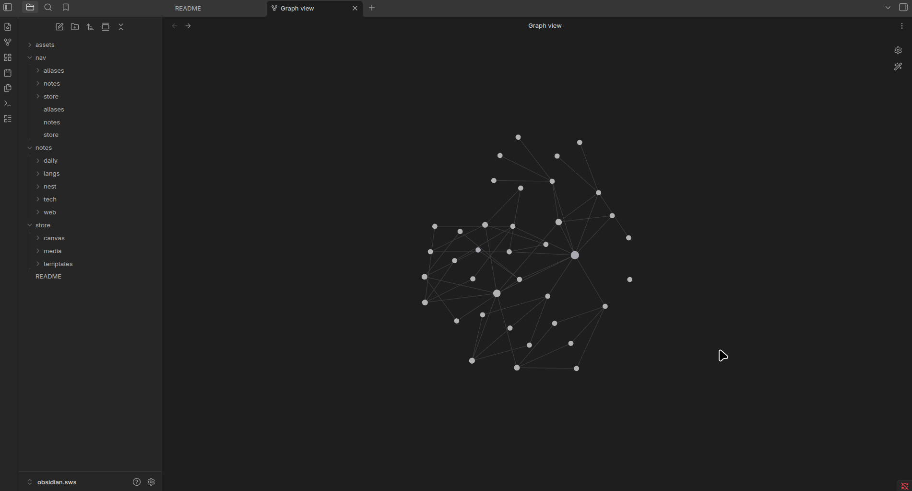
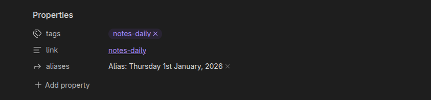

# Obsidian Spider-Web-Structure



>[!note]
>Directories: another name for folders, MOC: short for Maps of Content, QOL: short for Quality of Life

The sws method utilizes three main directories; `nav`, `notes` and `store` each directory serves a specific purpose.

## nav

The `nav` (short for navigation) directory follows a map of contents style for note organization. Instead of ending up in a nested directory trap, you navigate via linked notes or simply put it's a table of contents for your notes.

## notes

The `notes` directory stores all your markdown notes, with the exception of templates which still be placed in the `store` directory.

## store

The `store` directory stores all files `canvas`, `media` (images, documents, etc.) the only exception for markdown notes is the `templates` directory.

>[!warning]
>When cloning or downloading the github repo be sure to delete `assets` and `README.md` (after reading) as they're irrelevant to the obsidian vault.

### Directory Structure

Within each of the three main directories there's only _one_ nested directory per topic, for e.g

```markdown
. (your obsidian vault)
├── nav (moc)
|   ├── aliases.md
|   ├── notes.md
|   ├── store.md
|   ├── aliases (moc / same as notes, but for aliases)
|   │   ├── aliases-daily.md
|   │   ├── aliases-langs.md
|   │   ├── aliases-nest.md
|   │   ├── aliases-tech.md
|   │   └── aliases-web.md
|   ├── notes (moc / for notes)
|   │   ├── notes-daily.md
|   │   ├── notes-langs.md
|   │   ├── notes-nest.md
|   │   ├── notes-tech.md
|   │   └── notes-web.md
|   └── store (moc / for store)
|       ├── store-canvas.md
|       ├── store-media.md
|       └── store-templates.md
├── notes (only one nested directory per topic w/ notes only)
|   ├── daily (topic)
|   │   ├── 01-01-2026.md (note inside topic)
|   │   ├── 02-02-2026.md
|   │   └── 03-03-2026.md
|   ├── langs
|   │   ├── french.md
|   │   ├── german.md
|   │   └── spanish.md
|   ├── nest
|   │   ├── random.md
|   │   ├── things.md
|   │   └── wow.md
|   ├── tech
|   │   ├── hardware.md
|   │   ├── programming.md
|   │   └── software.md
|   └── web
|       ├── site.md
|       ├── sites.md
|       └── siting.md
└── store (files)
    ├── canvas (files `.canvas`)
    │   ├── fork.canvas
    │   ├── spoon.canvas
    │   └── spork.canvas
    ├── media (files `.{jpg,jpeg,png,pdf,etc}`)
    └── templates (templates are the only `.md / markdown` file in `store`)
        ├── daily.md
        ├── linux.md
        └── random.md
```

### Note Structure

> Within each note will have an example of how the properties are used (the example below is the non rendered example in obsidian's source mode)

```markdown
---
tags:
  - notes-daily
link: "[[notes-daily]]"
aliases:
  - "Alias: Thursday 1st January, 2026"
---

Each note is linked back to its topic in their related nav file, in this case `notes-daily` 

This note is also linked again, but in the `aliases-daily` file, for Aliases, you can choose any amount of alternate names or name format.
```

> The default render of properties in obsidian



#### Default File Locations

> Notes and files location:

- Settings > Files and links > Default location for new notes (Choose in the folder specified below) > Folder to create new notes in > enter `notes/nest`
- Settings > Files and links > Default location for new attachments (Choose In the folder specified below) > Attachment folder path > enter `store/media`
- Settings > Canvas > Default location for new canvas files > In the folder specified below > Folder to create new canvas files in > enter `store/canvas`
- Settings > Daily notes > New file location > enter `notes/daily`
- Settings > Daily notes > Template file location > enter `store/templates/daily`
- Settings > Templates > Template folder location > enter `store/templates`
- Settings > Web viewer > Save page folder > enter `notes/web`

#### QOL Changes

> Some qol changes you might find useful:

| Settings            | Toggle On            | Use Case                                                                                         |
| ------------------- | -------------------- | ------------------------------------------------------------------------------------------------ |
| Editor<br>└─Display | Readable line length | Notes will span the entire page length instead of center placement                               |
| Editor<br>└─Display | Line numbers         | Displays line numbers on the left of the page                                                    |
| Core plugins        | Slash commands       | Typing **/** followed by a command will give a context menu of available commands, e.g `/insert` |
| Core plugins        | Web Viewer           | Search the web inside obsidian and save notes directly to your vault                             |

> CLI/ Terminal specific qol changes:

| Settings                    | Toggle On              | Use Case                                                                                            |
| --------------------------- | ---------------------- | --------------------------------------------------------------------------------------------------- |
| General                     | Command line interface | Using obsidian via the cli/ terminal                                                                |
| Files & Links<br>└─Advanced | Allow URI Callbacks    | Opening obsidian vaults via the cli / terminal, e.g `xdg-open "obsidian://open?vault=obsidian.sws"` |
